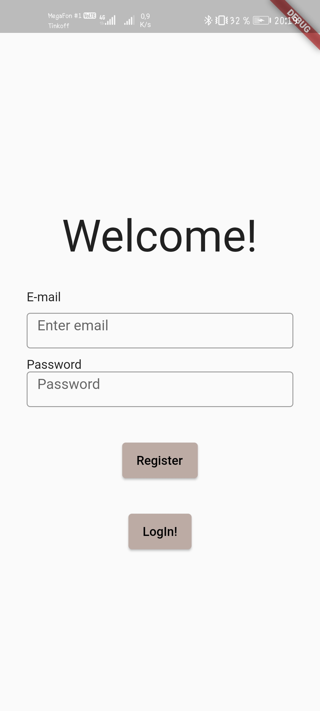
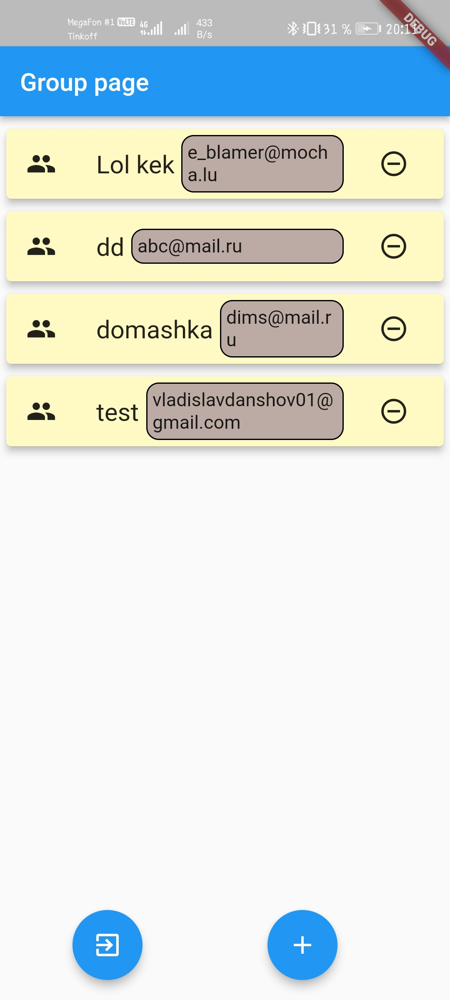
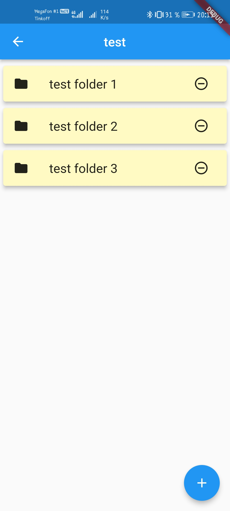
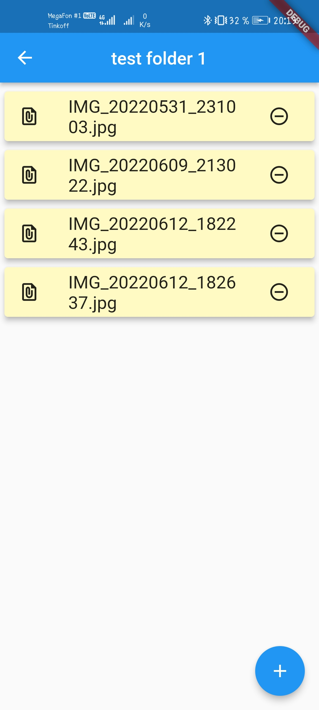

# Innostudy

Innostudy - is the application that helps students of Innopolis University with education.

## Description

Our application is the storing system for sharing abstracts, problem solutions and other stuff related to study. 
Students can create their own groups where they can share the content <i>(video, images, documents etc.)</i> with other people.

## Demonstration

<div float="left">
  
  
  
  
</div>


## Technologies used

Whole application was built using [Flutter](https://flutter.dev) framework.
To store user information we used a Authentication from [Firebase](firebase.google.com) platform.
Furthermore, Firestore and Storage services was connected to create the file system.
For uploading and opening files in Android we import [File Picker](https://pub.dev/packages/file_picker) and [Open File](https://pub.dev/packages/open_file) libraries to our project.

## Project installation for modifications
Before project installation be sure that you have installed [Flutter](https://flutter.dev) framework

1. Clone the repository
```console
git clone https://github.com/blueberry13-8/innostudy
```

2. Go to the root of the project
```console
cd <PATH>/innostudy
```

3. Download all dependencies
```console
flutter pub get
```
Now you can do any changes and modification in project.
